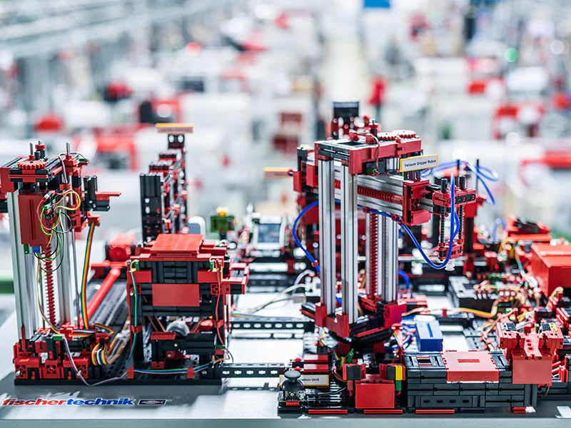
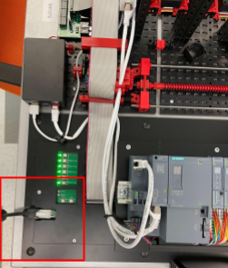
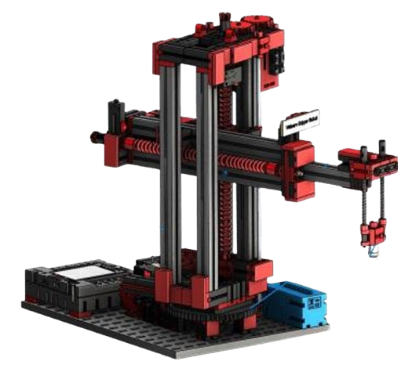
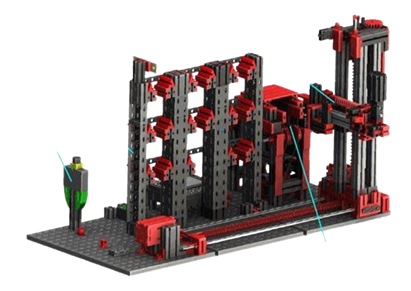
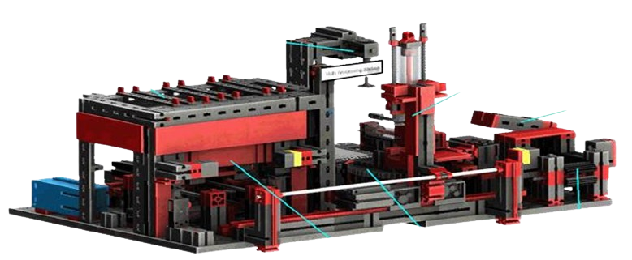
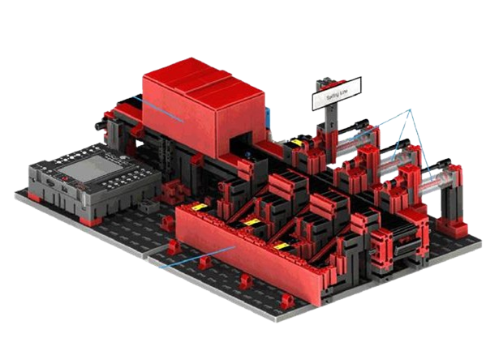
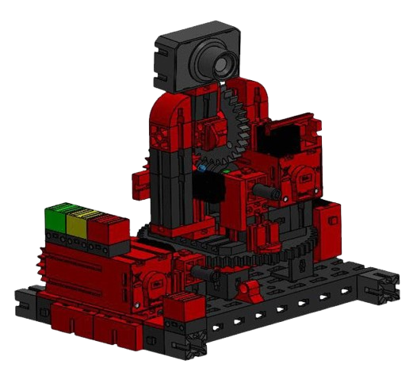
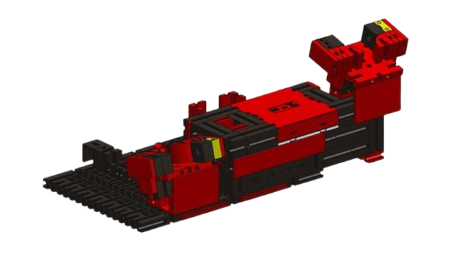
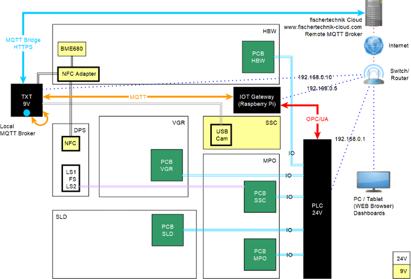
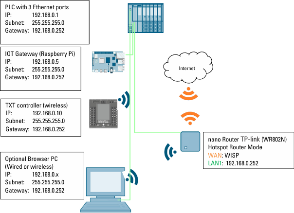

# Factory 4.0 Quick Start Guide

## Quick Start

Due to the pre-assembled nature of the Factory 4.0, everything is plug-and-play.



### Initial Setup

#### 1. Power Connection

- Locate the power plug and connect the 24V power supply.
- The factory may move and calibrate itself as part of the startup process.



#### 2. Wi-Fi Connection

- Connect to the TPLink's Wi-Fi:
  - **SSID:** `TP-Link-DACE-5G`
  - **Password:** `62021463`
- Open a browser (Firefox or Chromium-based) and navigate to: [http://tplinkwifi.net](http://tplinkwifi.net)
- Login credentials if prompted:
  - **Password:** `VGr#619`

#### 3. TPLink Configuration (if connecting to new WiFi)

- Click **Quick Setup**
- Ensure **Dynamic IP** is selected and click **Next**
- Select the desired Wi-Fi from the AP List and complete the setup process
- **Note:** Avoid connecting to `SDSU_Guest`, as it can block factory connections to the fischertechnik cloud

#### Connectivity

- Once configured, the TPLink connects the TXT 4.0 to the selected Wi-Fi, enabling cloud access
- Access the following interfaces:
  - **Node-RED Dashboard:** [http://192.168.0.5:1880/ui](http://192.168.0.5:1880/ui)
  - **fischertechnik Cloud:** [fischertechnik-cloud.com](fischertechnik-cloud.com)

## Definitions & Parts

### VGR: Vacuum Suction Gripper Robot

- **Description:** 3-axis robot with pneumatic cylinders and a 3/2-way solenoid valve for suction
- **Tasks:** Transporting goods to all of the different parts of the Factory



### HBW: High-Bay Warehouse

- **Description:** Storage area with retrieval function with stacker crane. Also holds one of the environmental sensors for the Factory
- **Tasks:** Organizing and storing workpieces



### MPO: Multi-Processing Station with Kiln

- **Description:** Uses kiln, turntable, and separate VGR; kiln heats work piece, VGR moves to turn table for milling, conveyor takes to SLD

- **Tasks:** Heat, move, mill, and eject workpieces



### SLD: Sorting Line with Color Recognition

- **Description:** Components are sorted by reflection (with consideration to ambient lighting). Sorting line starts when the photoelectric barrier is interrupted

- **Tasks:** Detect color, sort, and eject workpieces based on color



### SSC: Environmental Station with Surveillance Camera

- **Description:** Monitors factory conditions: air temp, humidity, pressure, quality, and brightness. Sits on top of the MPO
- **Tasks:** Measure environmental factors, control camera, and display data
- **Note:** sometimes combined with **MPO**, called **SSC-M**



### DPS: Delivery and Pickup Station

- **Description:** Constraints I/O unit, color recognition, and NFC reader; used for identification and recording of work pieces
- **Tasks:** Detect workpieces, assign color data, and store data on NFC tags



## Block Diagrams

### Communication Interfaces

- The TXT controller acts as a local MQTT broker, bridging the factory and fischertechnik cloud.
- The TXT and PLC communicate via an IoT gateway using the OPC/UA protocol



### Network Structure

- All factory components communicate through I/O and the TXT controller, which connects to the fischertechnik cloud
- For administrative tasks, [SSH](#accessing-the-factory) into the TXT controller while connected to the TPLink



## Important Links

- **Node-RED Dashboard:** [http://192.168.0.5:1880/ui](http://192.168.0.5:1880/ui)
- **fischertechnik Cloud:** [http://fischertechnik-cloud.com](http://fischertechnik-cloud.com)
- **Activity Booklet:** [Download Link](https://www.fischertechnik.de/-/media/fischertechnik/rebrush/industrie-und-hochschulen/technische-dokumente/02-lernfabrik-4-0-24v/560840560841554868trainingfactory40-24v.pdf)
- **TPLink Configuration:** [http://tplinkwifi.net/](http://tplinkwifi.net/)
- **GitHub Repository:** [plc_training_factory_24v github](https://github.com/fischertechnik/plc_training_factory_24v)

## System & Part Access

### Accessing the Factory

1. SSH into TXT Controller:
    - **Hostname:** `192.168.0.10`
    - **Username:** `ft`
    - **Password:** `fischertechnik`
    - **Command:** `ssh ft@192.168.0.10`
2. Access Logs
    - **Example log file path:** `workplace/gatewayplc/log.txt`
    - To monitor logs in real-time:

    ```bash
    tail -f workplace/gatewayplc/log.txt
    ```

## Deploying Code

### Setting Up the TXT Controller

1. **Firmware Updates:**
    - To view if there are any updates on the TXT 4.0 Controller, navigate to the settings on the touch-screen display of the TXT Controller and look for the updates tab.
2. **Configuration:**
    - While most of the TXT should already be set up, there are instructions provided in the [How To Setup TXT Controller guide](https://github.com/fischertechnik/plc_training_factory_24v/blob/master/howto_new_TXT.md)

### Deploying Programs

There are a few ways to upload programs to the Factory 4.0, depending on the program type.

1. **Deploying to TXT:**
There are also a few ways to deploy to the TXT 4.0 Controller, and potentially some we might've missed:
    - **For most programs,** you should use the TXT [WEB server](https://github.com/fischertechnik/txt_training_factory/blob/master/doc/WEBServer.md) to save and upload programs from your PC to the TXT.
    - If the above method doesn't work, it should be possible to [SSH](#accessing-the-factory) directly into the TXT and upload any programs from there. *Be cautious of removing any system files!*
2. **Deploying PLC Programs:**
    - While unable to directly test this, I suspect the SD card inside the SIMATIC 27-1500 handles deploying PLC programs. As long as the Factory is off, it's safe to remove the SD card.
